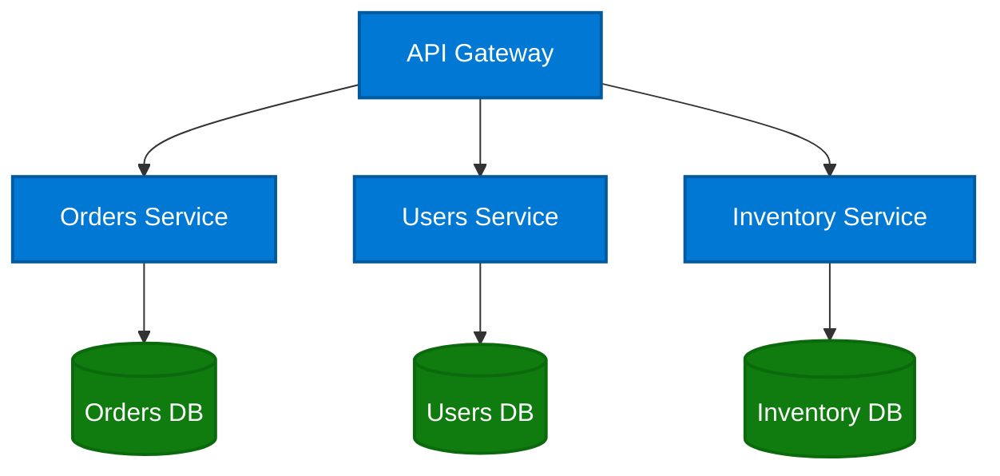

# diagram-gen

A Copilot CLI skill that generates publication-quality Mermaid diagrams with Microsoft Fluent theming. Just describe what you want, and it handles the rest: consistent colors, proper layout, Learn-compliant alt-text, and rendered SVG output.

## Quick Examples

### Generate a diagram from a description

> "Draw an architecture diagram showing an API Gateway connecting to three microservices, each with their own database"

The skill translates your description into themed Mermaid code, applies Microsoft Fluent colors, and renders to SVG:



### Audit a document for missing diagrams

> "Scan articles/foundry/how-to/agent-service-disaster-recovery.md and propose diagrams"

The skill reads the article, identifies sections that would benefit from visual aids, and generates:
- Rendered SVG diagrams with Microsoft theming
- Learn-compliant alt-text (40-150 chars, starts with diagram type, ends with period)
- Placement suggestions (which section to insert after)
- Long descriptions for complex diagrams

### Batch-audit a documentation set

> "Review the 8 articles authored by jburchel in the Foundry docs and generate diagrams for each"

Produces a self-contained HTML review page with all diagrams embedded, linked to live article URLs, ready to share with reviewers. [See a real example](foundry-diagram-proposals.html).

### Convert a rough diagram to a polished one

> "Here's a screenshot of my whiteboard diagram. Convert it to a clean, standardized version."

Attach an image; the skill extracts the logical structure, recreates it as Mermaid with proper theming, and renders a publication-ready SVG.

### Generate a diagram for a web page

> "Review https://learn.microsoft.com/en-us/azure/foundry/agents/overview and create a diagram for it"

The skill reads the page content, identifies the key concepts and relationships, and generates an appropriate diagram with alt-text.

## Features

- **Microsoft Fluent color scheme** -- Consistent branding using official Microsoft/Fluent Design colors
- **Multiple operation modes:**
  - Describe a diagram in natural language, get a rendered SVG/PNG
  - Convert a poorly drawn diagram image to a clean, standardized one
  - Point it at a page, get a relevant diagram
  - Batch-scan documents, propose diagrams with placement and alt-text
- **Learn-compliant alt-text** -- Validates against Microsoft Learn Contributors Guide (40-150 chars, proper prefixes, etc.)
- **Edge routing rules** -- Prevents lines from crossing through text labels
- **Deterministic output** -- Same input always produces the same diagram (unlike AI image generators)
- **Live article links** -- Review reports link article paths to their published learn.microsoft.com URLs

## Installation

### As a Copilot CLI user extension

```bash
# Copy to your user extensions directory
cp -r .github/extensions/diagram-gen ~/.copilot/extensions/diagram-gen

# Install the rendering engine
npm install -g @mermaid-js/mermaid-cli
```

### As a project extension

```bash
# Clone into your project root; .github/extensions/ is auto-discovered
git clone https://github.com/jonburchel/diagram-gen.git
cd diagram-gen && npm install
```

## Theme Configuration

The Microsoft theme is defined in `config/ms-theme.json` and `config/ms-styles.css`. The theme uses:

| Color Class | Hex | Use For |
|-------------|-----|---------|
| `msBlue` | `#0078D4` | Services, APIs, primary components |
| `msGreen` | `#107C10` | Databases, storage, data stores |
| `msYellow` | `#FFB900` | Decisions, gateways, warnings |
| `msRed` | `#D13438` | Errors, alerts, critical paths |
| `msNeutral` | `#F3F2F1` | Users, actors, external inputs |
| `msGray` | `#605E5C` | External systems, third-party |
| `msPurple` | `#8764B8` | Queues, events, async operations |

## Conventions

The skill enforces consistent diagramming standards:

- **Layout direction**: TB for architectures/hierarchies, LR for process flows/timelines
- **Node shapes**: Rectangles for services, cylinders for databases, diamonds for decisions, stadiums for actors
- **Arrow types**: Solid for sync, dotted for async, thick for data flow
- **Complexity limits**: Max 12 nodes per diagram; split into sub-diagrams if needed
- **Edge routing**: No lines through text; many-to-many patterns restructured to avoid crossings
- **Alt-text**: Validated per Learn Contributors Guide (40-150 chars, starts with type, ends with period)

See [plan.md](plan.md) for the full specification.

## Example Output

- [`review.html`](review.html) -- 4 diagrams for the [Foundry Agent Service Overview](https://learn.microsoft.com/en-us/azure/foundry/agents/overview)
- [`foundry-diagram-proposals.html`](foundry-diagram-proposals.html) -- 13 diagrams across 8 Foundry articles, with placement suggestions and alt-text

## Dependencies

- `@mermaid-js/mermaid-cli` (mmdc) -- Rendering engine
- Puppeteer/Chromium -- Required by mmdc
- Copilot CLI -- For the extension runtime

## License

MIT
